# Lattice defect detection — methodology

How every number in this directory is produced, and where every threshold comes from.

Specimen: `0point5dash1`, the 9×9×9 octet-truss, 761×815×837 voxels. Design: 18,468
struts over 10,206 junction entries → 3,430 physical nodes. All figures below are the
ones committed alongside this file.

| stage | code | writes |
|---|---|---|
| geometry + cylinder fill | `src/lattice_iou.py::measure_struts` | `struts.csv`, `profiles.npz` |
| connectivity | `src/lattice_iou.py::measure_connectivity` | `connectivity.npz` |
| cross-sections | `src/strut_sections.py::measure_sections` | `sections.npz` |
| strut classes | `scripts/classify_strut_defects.py::classify` | `strut_classes.csv` |
| node sphere fill | `src/lattice_iou.py::measure_node_sphere_fill` | `node_health.csv` |
| node sizes | `src/lattice_iou.py::measure_nodes` | `nodes.csv` |

---

## 1. Shared geometry

**Voxel size is derived, never read from a header.** An octet strut spans half a face
diagonal, so `|strut| = cell/√2`. Solving against the known 4.56 mm cell
(`lattice_geometry`):

```
strut_length_vox = median |p1 − p0|  = 55.406
cell_vox         = 55.406 × √2       = 78.356
µm_per_vox       = 4560 / 78.356     = 58.196
r_strut          = 350/2 / 58.196    = 3.007 vox
r_node (nominal) = 1.467 × r_strut   = 4.411 vox = 257 µm
```

**The local frame** (`_axis_frame`) — for each voxel `p` near the segment `a → b`:

```
d = b − a      L = |d|      u = d/L
w = p − a
s = clip(w·u, 0, L)        axial coordinate
ρ = |w − s·u|              radial distance
```

`{ρ ≤ r}` is therefore a capsule, and every measurement below is a set operation on it.

**Registration is not optional.** The shipped coordinates carry a ~1% residual scale
error, which at a 3 vox strut radius walks the design off the material at the far
corners. Same code, shipped vs corrected: median IoU **0.256 vs 0.607**, and critically
**no empty gap exists at all** on the shipped coordinates (gap width 0.000, p1 IoU
0.000) — the defect population is entirely swamped. Always pass
`--correction outputs/registration/correction.json`.

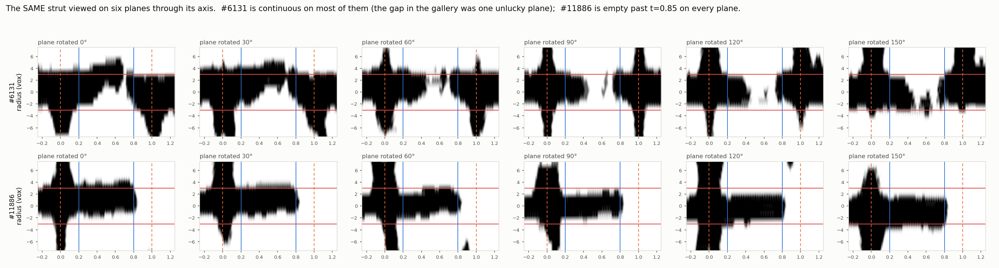

---

## 2. What is excluded before any class is assigned

`classify_strut_defects.measurable()`. A strut is dropped because the *measurement*
cannot be made, never because of its health, and the exclusions are reported as a count
and never folded into the tallies.

```
is_boundary == 0  ∧  embedded == 0  ∧  ¬clipped  ∧  border_frac ≤ 0.25
```

| exclusion | rule | n |
|---|---|---|
| boundary-cap | `unit_cell_edge_idx ∈ {8,9,10,11,16,17,18,19,32,33,34,35}` | 972 |
| plate-embedded | `env_material_frac ≥ 0.80` | 556 |
| window-touching | `border_frac > 0.25` | 207 |

**16,733 measurable of 18,468.**

The build plates are why the second one exists. The volume has solid plates at both z
ends — per-slice foreground ~75% for z<28 and z>740, tapering *obliquely* (the specimen
is tilted, so no flat z cut works) to the ~4% lattice level by z≈50 / z≈725. The outer
design node planes sit inside that bulk metal, where a missing strut leaves no signature
at all. It is detected geometrically, not by a z cut.

---

## 3. Strut methods

### 3.1 `missing` — 89 (0.532%)

Two independent conditions, both counts, **no threshold**:

```
C = {ρ ≤ r_strut}                     nominal 350 µm cylinder
E = {ρ ≤ 1.6·r_strut}                 envelope; localises the union so a
                                      neighbouring strut cannot pollute it
n_matched = |C ∩ M|                   M = the CT mask
IoU       = |C ∩ M| / (|C| + |E ∩ M| − |C ∩ M|)

missing ⟺ n_matched ≤ 0  ∧  empty_sections ≥ n_sections
```

Not one voxel of the nominal cylinder is material, **and** every cross-section is empty.
It is `== 0`, not `< ε`.

The distribution is why that is the right instrument: **90 measurable struts sit at IoU
exactly 0.000000, and the next value up is 0.0018.** An IoU cut here would invite a
number like "0.06" that looks like a tolerance and is really the middle of dead space.

Of those 90, 89 are labelled missing; one has a non-empty section (material present but
off the design axis) so it fails the second condition and stays `broken`. That is the
second condition earning its place.

### 3.2 `broken` — 155 (0.926%)

Topological, measured directly (`measure_connectivity`), also **threshold-free**:

```
T        = {ρ ≤ 2·r_strut}            tube, UNtrimmed, full node-to-node
material = M ∩ T
cost(v)  = 1 if material else ∞
geo_len  = MCP_Geometric(cost).find_costs([seed_A], [seed_B])
detour   = geo_len / L

broken ⟺ ¬reachable ∧ ¬clipped ∧ ¬no_seed
```

The tube is what makes it work — a plain connected-component test says every strut is
connected, because the whole lattice is one component. Seeds are the node centres; if a
centre is empty (a failed node) the nearest material inside the tube is used, so the
strut is still tested rather than silently dropped.

`detour` on the connected struts is a **spike at 1.0** — median 0.9991, p95 1.0192,
p99.9 1.0554, max 1.0726 — far tighter than IoU (peaks at 0.6) or section radius
(bimodal), which is the evidence that the tube is not letting in wandering paths.

This replaced a "≥2 empty cross-sections" rule, which was the wrong instrument twice
over: **65 of the 155 severed struts have no empty band at all**, because independent
planes have no access to a topological property and a crack narrower than the section
spacing reads full on every plane; and moving the cut from 2 to 1 swung the count
62 → 99, i.e. a threshold deciding a class rather than measuring one.

### 3.3 `thin` / `thick` — 1,740 (10.399%) and 350 (2.092%)

Measured on planes cut **perpendicular to each strut's own axis** (`strut_sections`).
That is what removes obliqueness: the lattice is oblique to every slice plane of the
volume, so a strut cuts an axis-aligned slice as an ellipse whose shape encodes its
*tilt*, and every 2D metric computed that way tracks tilt as much as health. In the
strut's own frame a healthy strut is a circle regardless of orientation.

```
binary   = interpolated_section ≥ 0.5        trilinear, step 0.5 vox
sel      = connected component at centre     (or nearest within 2·r_strut)
area     = npix × step²
r_eq     = √(area/π)                         equivalent-circle radius
r_eq_med = median over non-empty sections

thin  ⟺ r_eq_med < 262.5/2/58.196 = 2.255 vox
thick ⟺ r_eq_med > 437.5/2/58.196 = 3.759 vox
```

Sampling is sub-voxel (`step = 0.5`) because an as-built strut is only ~4.4 voxels
across; at whole-voxel resolution a section is ~15 px and no shape statistic on it means
anything. The window half-width is `2.5 × r_strut ≈ 7.5 vox`, deliberately **narrower
than the ~9.5 vox neighbour separation** at the trim point, so a neighbouring strut sits
outside the frame instead of fusing into it.

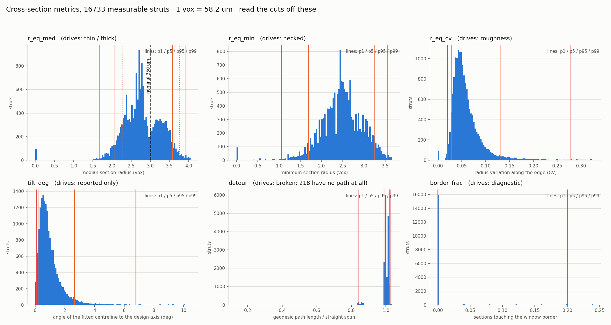

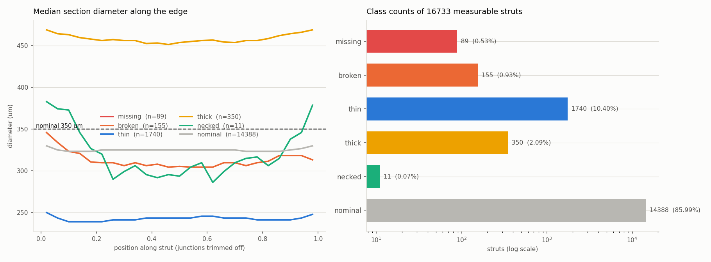

### 3.4 `necked` — 11 (0.066%)

A local pinch on an otherwise normal strut:

```
r_eq_min = min over non-empty sections
necked ⟺ r_eq_min < 1.0555 vox (123 µm dia)  ∧  r_eq_med ≥ thin cut
```

The second clause is what makes it *necked* rather than *thin* — normal median, local
minimum. Independent corroboration: these 11 carry the highest detours in the lattice
(1.015–1.068), so shape and topology agree that necking is a partial break without being
wired together.

### 3.5 `nominal` — 14,388 (85.986%)

Everything else.

### 3.6 Severity order

`classify()` applies rules in sequence, later overriding earlier:

```
necked → thick → thin → broken → missing
```

So a strut both broken and thin reports `broken`; both missing and broken reports
`missing`.

**A consistency check falls out of this.** 218 measurable struts have no node-to-node
path. 63 of them also have an empty nominal cylinder → relabelled `missing`, leaving
155 `broken`. The remaining 89 − 63 = **26 struts have an empty nominal cylinder yet are
still connected** through the tube: material exists but sits >3 vox off the design axis.
Those are candidates for *badly displaced* rather than absent, and are worth auditing
before the missing count is trusted.

### 3.7 Per-strut visual audit

One strut per class: lateral view through the axis on the left (a gap is a white column
and needs no statistic to see, but it is one plane and misses anything off it), and
cross-sections along it on the right (they see all round the strut but are independent,
so they cannot show continuity). Side by side each covers the other.

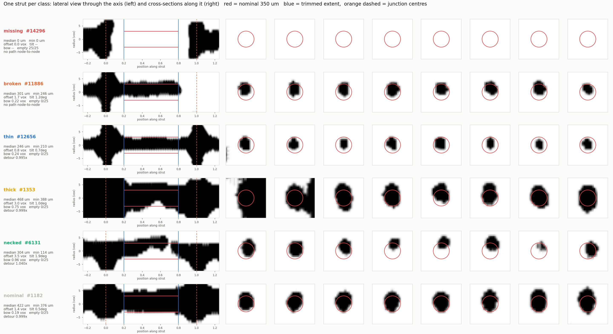

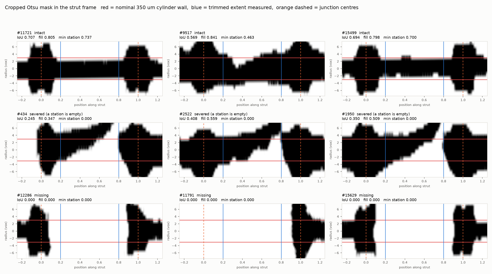

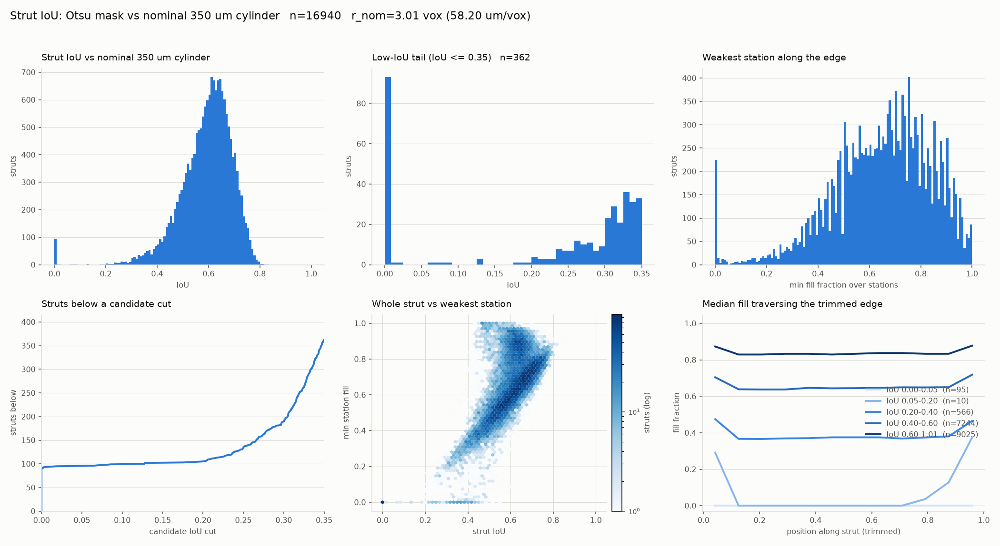

### 3.8 Spatial distribution

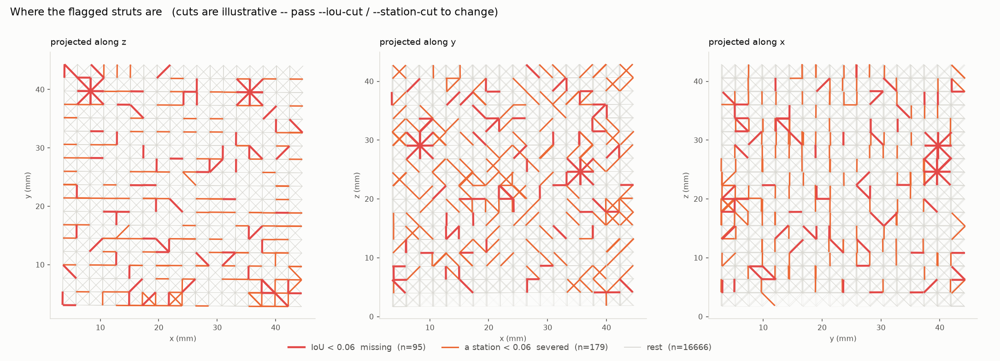

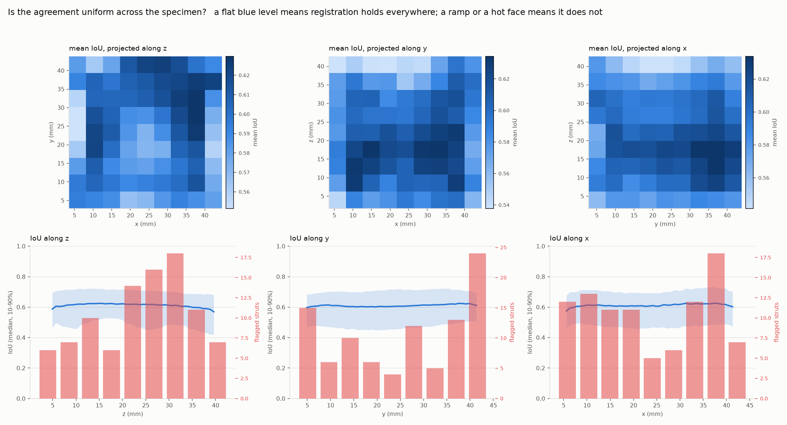

---

## 4. Node method

### 4.1 The test

**How much of a sphere about the node is material.** That is all of it
(`measure_node_sphere_fill`):

```
fill = |{ρ ≤ r_node} ∩ M| / |{ρ ≤ r_node}|
```

evaluated on a local box with the sub-voxel centre offset carried, so the sphere is not
quantised to the voxel grid.

**Result: 0.000 for exactly 2 of the 2,456 interior nodes, 1.000 for essentially every
other one.** Min 0.000, p1 0.986, median 1.000. The largest gap in the sorted
distribution is **0.901 wide**, so the cut is read off the gap rather than chosen — it
lands at 0.451 and could be put anywhere in (0.000, 0.901) without changing the answer.

| node | z | y | x | fill | incident struts missing |
|---|---|---|---|---|---|
| 1935 | 423 | 679 | 611 | 0.000 | 12 of 12 |
| 2189 | 499 | 683 | 143 | 0.000 | 12 of 12 |

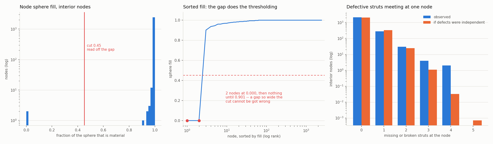

### 4.2 Why the reading is binary

A node is present whole or absent whole, because **it is not a separately printed part**.
In the design JSON a junction is a bare `{id, position, indices}` — no radius, no
thickness; only struts carry `thickness`. The junction is the region where twelve struts
overlap, plus the fillet the melt pool leaves where their scan vectors converge.

The specimen confirms it. Minimum node fill against how many incident struts are
missing or broken:

| defective struts | nodes | min fill |
|---|---|---|
| 0 | 2138 | 0.986 |
| 1 | 280 | 0.937 |
| 2 | 30 | 0.945 |
| 3 | 4 | 0.901 |
| 4 | 2 | 0.969 |
| **12** | **2** | **0.000** |

Node material survives losing four of twelve struts essentially intact and collapses only
when all twelve are gone, with nothing in between. So a hit is a *localised build failure
that took a whole junction with it* — a more useful thing to report than twelve unrelated
missing struts.

Corollary: do not look for a node absent while its struts are present. The struts alone
would fill the sphere, and there is nothing at a junction that could go missing on its
own.

### 4.3 Nothing turns on the radius

Swept in the run itself rather than asserted:

| radius | µm | gap width | nodes flagged |
|---|---|---|---|
| 1.467 r | 257 | 0.901 | 2 |
| 1.800 r | 315 | 0.855 | 2 |
| 2.000 r | 350 | 0.822 | 2 |
| 2.400 r | 420 | 0.733 | 2 |
| 2.800 r | 490 | 0.598 | 2 |
| 3.000 r | 525 | 0.551 | 2 |

Default is the design node radius, 1.467 r, which is also the widest gap.

### 4.4 The independent cross-check

Degree. Every physical node knows which struts meet it, and `measure_connectivity`
already says for each strut whether metal joins its two ends, so *"of the struts that
should meet here, how many arrive?"* is a count needing no threshold:

```
arrive = incident_usable − incident_bad
dead ⟺ degree == 12 ∧ incident_usable ≥ 8 ∧ arrive == 0
```

This comes from the **strut labels**; the sphere fill comes from the **voxels**. They
flag the same two nodes, **0 disagreements**. Two instruments on independent evidence
agreeing is the reason to believe the result.

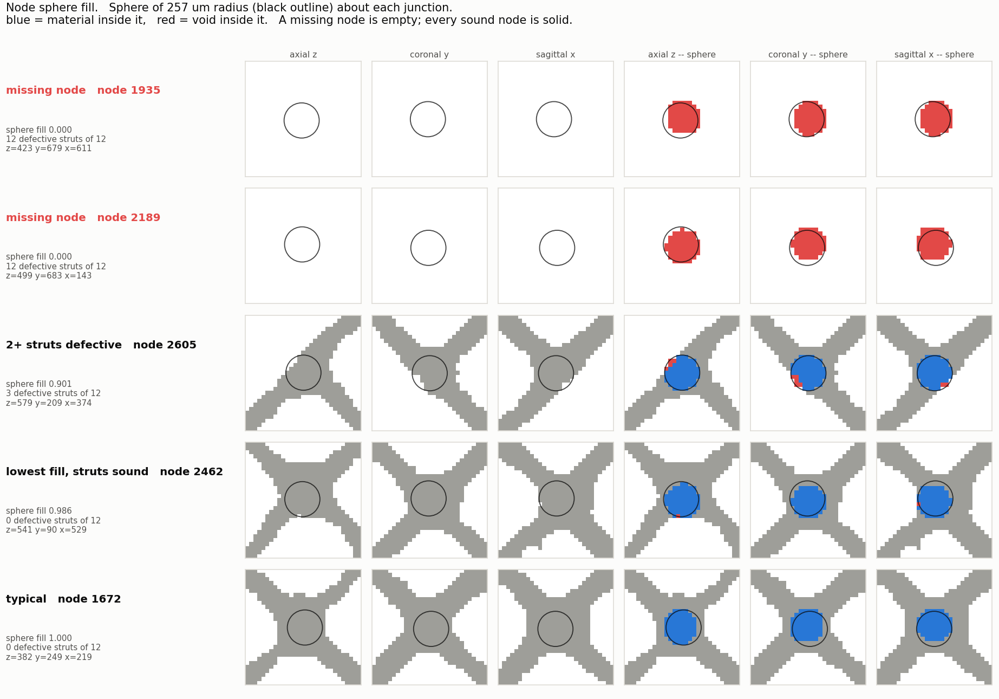

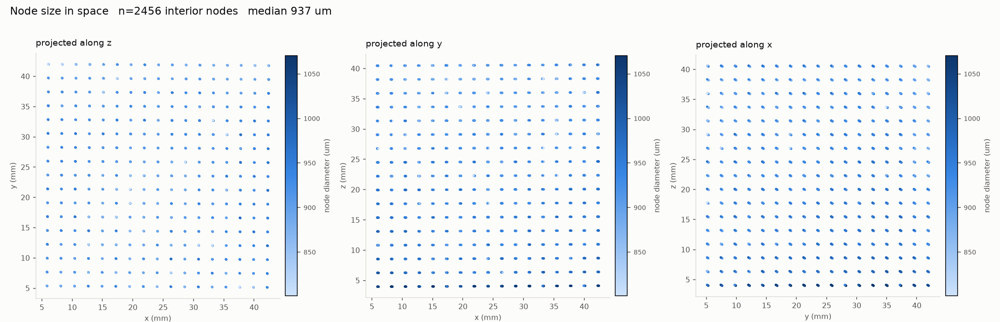

### 4.5 Node *sizes* are a separate measurement

`measure_nodes` reports node IoU and two radii; none of it detects anything. Node IoU is
a tight spike at **0.250** that anticorrelates with node size, because as-built junctions
(~937 µm) are far larger than the nominal sphere (~513 µm), so the union is dominated by
material *outside* it. **It is a size proxy — do not threshold it.** Of the two radii,
threshold the smooth 90%-fill radius, not the EDT max-inscribed radius, which is
quantised to √integer (≈1,600 nodes pile onto exactly 6.00 vox).

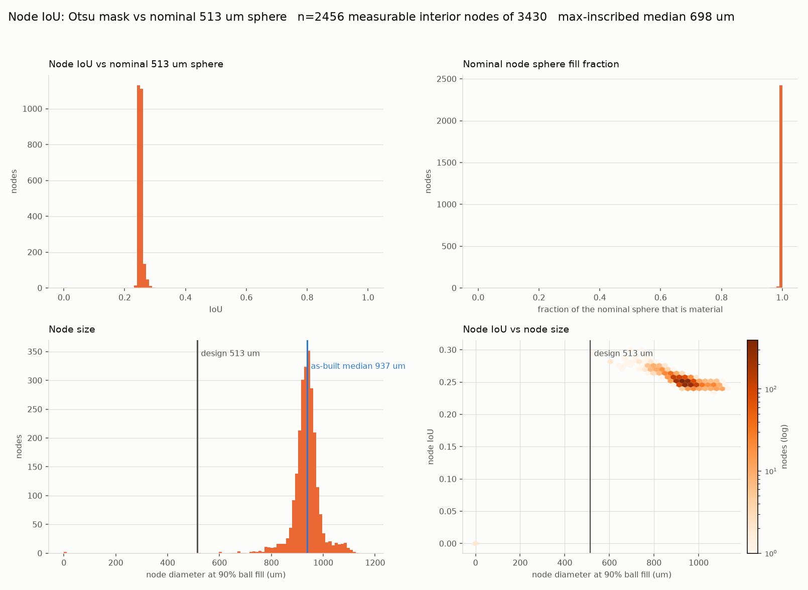

---

## 5. Every threshold, and where it comes from

Three kinds, and the distinction is the point.

### Kind A — no threshold at all

The rule is a count that is either zero or not, so there is nothing to tune.

| quantity | rule | class |
|---|---|---|
| `n_matched` | `== 0` | `missing` |
| `empty_sections` | `== n_sections` | `missing` |
| `reachable` | boolean geodesic | `broken` |

### Kind B — read off an empty gap in the data

Not chosen; located. Each is reported with the gap width so the reader can see there was
no choice to make.

| quantity | cut | gap it sits in | flagged |
|---|---|---|---|
| node `sphere_fill` | 0.451 | 0.000 → 0.901 | 2 nodes |
| strut IoU (cross-check only) | — | 0.000 → 0.0018 | 90 struts |

### Kind C — anchored on the design, not the specimen

| parameter | value | provenance |
|---|---|---|
| `--tol-frac` | 0.25 | ±25% of the **design** 350 µm → 262 / 438 µm |
| `thin` | 2.255 vox | = 262.5 µm /2 / 58.196 |
| `thick` | 3.759 vox | = 437.5 µm /2 / 58.196 |

**Why design-anchored and not percentile.** Percentile cuts are self-fulfilling: they
return a fixed ~1% thin however the part came out, and would call a uniformly undersized
lattice healthy. The as-built median is a property of *this* print and is not knowable at
design time. The cost is that a systematic process bias lands in the class counts instead
of being absorbed by the cut — so the run always prints both anchors:

```
nominal design diameter 350 µm vs as-built median 320 µm  (91% of nominal)
thin/thick band: ±25% of nominal → 262 / 438 µm  (p11.0 and p97.9 of the measured struts)
```

Read those two lines before believing any thin/thick tally.

### The one percentile cut that remains

| parameter | value | provenance |
|---|---|---|
| `--neck` | p1 of `r_eq_min` = 1.0555 vox (123 µm) | distribution of the measured minimum |

`necked` is explicitly a *relative* defect — a pinch relative to this strut's own median —
so a percentile is defensible here in a way it is not for thin/thick. It yields 11
struts (0.066%).

### Structural constants (geometry, not tolerances)

| parameter | value | why |
|---|---|---|
| `trim_frac` | 0.20 | junction blob is ~3× the strut diameter; an untrimmed cylinder measures the node |
| `env_factor` | 1.6 | union envelope for IoU, tight enough to exclude neighbours |
| `tube_factor` | 2.0 | connectivity tube; wide enough for a displaced strut, narrow enough to block detours |
| `dross_factor` | 2.2 | outer annulus for `excess_frac` |
| `window_factor` | 2.5 | section half-width 7.5 vox < 9.5 vox neighbour separation |
| `step` | 0.5 vox | an as-built strut is ~4.4 vox across; whole-voxel sections are meaningless |
| `level` | 0.5 | binarisation of the interpolated section |
| `embedded_frac` | 0.80 | build-plate detection, geometric rather than a z cut |
| `border_cut` | 0.25 | quarantines sections measuring this strut plus adjacent bulk |
| `speck_voxels` | 0 | raise to admit struts holding only isolated segmentation noise |
| empty station | `fill ≤ 0.02` | for `gap_stations` (reported, classifies nothing) |
| node `radius_factor` | 1.467 | the design node radius; answer unchanged over 1.5–3.0 |
| node interior gate | `degree == 12` ∧ `incident_usable ≥ 8` | a node needs most struts measurable before "how many arrive" means anything |

**One deliberate absence: no Otsu, anywhere.** An earlier version auto-selected cuts by
1-D Otsu / empty-gap search and it was removed as scope creep. For the record, Otsu on
strut IoU returns **0.563 — inside the healthy mode — flagging 5,291 struts**, because it
assumes comparable class mass and the defect class here is 0.5%.

---

## 6. Two caveats to carry with the numbers

### The thin/thick classes measure build orientation, not health

The diameter distribution is **bimodal by build angle**, with the nominal 350 µm line
sitting in the valley between the two modes:

| family | n | median dia | thin | thick |
|---|---|---|---|---|
| inclined ~45° | 11,225 | 344 µm (98% of nominal) | 3 | 350 |
| horizontal ~90° | 5,508 | 273 µm (78% of nominal) | 1,737 | 0 |

So `thin` is 1,737/1,740 horizontal and `thick` is 350/350 inclined — classic LPBF
downskin behaviour on unsupported horizontal features. **One band across the whole
lattice measures orientation.** Band per family, or normalise by family median.

`missing` and `broken` are immune because they are count-based, and their rates agree
across the two families (0.55% vs 0.49%) — a free cross-check.

The "as-built median 320 µm" printed by the run is the mixture of the two and describes
no actual strut.

### The section count

The cached `sections.npz` holds **25** sections per strut; the CLI default is `--sections
48`. A `--cached` run correctly takes the cache's own count (a mismatch previously broke
both `missing` and the break rule silently), but a fresh run resamples at 48 and will
move the thin / thick / necked counts. Every number in this file is from the 25-section
cache.

---

## 7. Results summary

**Struts**, 16,733 measurable of 18,468:

| class | count | % | median diameter |
|---|---|---|---|
| nominal | 14,388 | 85.986% | 325 µm |
| thin | 1,740 | 10.399% | 246 µm |
| thick | 350 | 2.092% | 456 µm |
| broken | 155 | 0.926% | 315 µm |
| missing | 89 | 0.532% | — |
| necked | 11 | 0.066% | 317 µm |

**Nodes**, 2,456 interior of 3,430 physical: **2 missing**, agreed by sphere fill and by
degree with 0 disagreements.

Against the specimen's nominal 0.5% missing, the measured **0.532%** agrees; the source
paper reports 0.57%.

---

## 8. Generalisability — what transfers to a new dataset

Short version: **any other octet-truss scan, yes. A different lattice topology, no.**

### 8.1 Topology-independent — reuse anywhere

These make no assumption about how the lattice is built, only that a design segment should
correspond to material:

| instrument | why it transfers |
|---|---|
| `missing` | a count `== 0` on the nominal cylinder; no geometry model |
| `broken` | geodesic reachability inside a tube about the axis |
| node sphere fill | material inside a sphere, or not |
| registration refit | block-wise offsets fitted by an affine field |
| build-plate exclusion | `env_material_frac ≥ 0.80`, purely local |

### 8.2 Octet-specific — these break, and here is exactly how

**1. The voxel scale rests on an octet identity.** `lattice_geometry` derives µm/voxel
from `|strut| = cell/√2`, which is true because an octet strut spans half a face diagonal.
On a lattice with more than one strut length the median length is not a length of
anything, and **every micron figure downstream — including the thin/thick band — becomes
silently wrong rather than absent.**

*Guarded.* `detect_lattice_defects` refuses when strut lengths spread more than 5% of the
median (this specimen: 0.34 vox over 55.41, i.e. 0.6%) and says why, instead of returning
plausible numbers.

**2. Node topology is hard-coded to octet coordination.** `degree == 12` defines an
interior node and the usability gate is `incident_usable ≥ 8`, i.e. 8 of 12.

*Fails loudly.* `detect_missing_nodes` errors when no degree-12 node exists, so a BCC or
Kelvin lattice is refused rather than mis-measured. It would need a topology-aware
definition of "interior" to run at all.

**3. Boundary caps are identified by an index convention — STILL UNGUARDED.**

```
BOUNDARY_EDGE_IDX = {8, 9, 10, 11, 16, 17, 18, 19, 32, 33, 34, 35}
```

These `unit_cell_edge_idx` values carry the outer-surface caps **in this generator's
parameterisation only**. A JSON from a different generator will exclude the wrong struts
with no complaint, shifting every rate. This is the one remaining silent-wrong-answer path
in the pipeline.

*Fix if this matters:* derive the caps geometrically — a cap strut has an endpoint on the
specimen's convex hull — rather than trusting an index.

**4. JSON schema is assumed.** `junctions[].position` in (x, y, z) and reversed on load;
`struts[].junction0` / `junction1`. No validation beyond a KeyError.

**5. The build axis is assumed to be volume axis 0** in the orientation breakdown of
§6. If the specimen was built along another axis the two families are mislabelled — though
the split itself would still show up, since it is a real bimodality.

### 8.3 Design constants must be passed, not assumed

`strut_diameter_um` (350) and `cell_mm` (4.56) are module defaults for these specimens.
Because µm/voxel is *derived* from `cell_mm`, getting it wrong rescales everything: passing
5.20 instead of 4.56 moves the scale 58.196 → 66.364 µm/voxel and the as-built median from
320 µm to 365 µm, with no error raised. Both are explicit parameters on the MCP tools;
supply them for any new specimen.

### 8.4 Delivery path for a new dataset

Three MCP tools in `src/mcp_server.py`, in order:

```
refit_lattice_registration   mask + design            -> correction.json
detect_lattice_defects       mask + design + correction -> strut_classes.csv
detect_missing_nodes         mask + design + correction + results_dir -> node candidates
```

Run the refit **first and check its residual**; on uncorrected coordinates the empty gap
that separates missing struts has width 0.000 and no cut exists at all, so the counts are
meaningless rather than merely noisy. `detect_missing_nodes` needs `results_directory`
from the defects run to perform the degree cross-check; without it it reports the sphere
fill alone and says so, because a single instrument should not be reported as confirmed.
