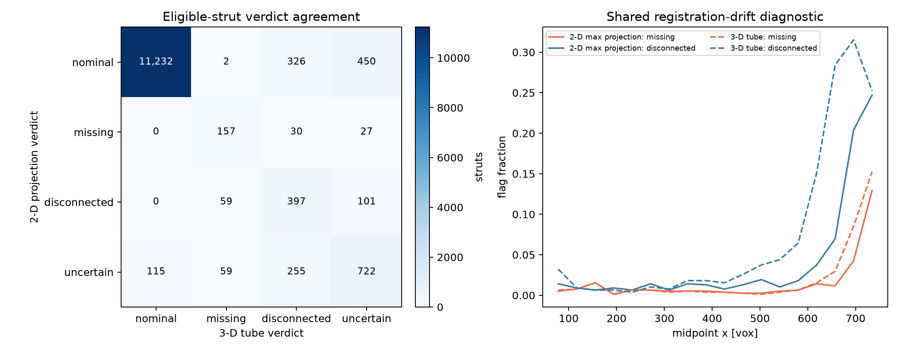
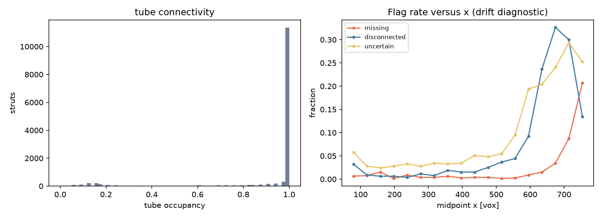
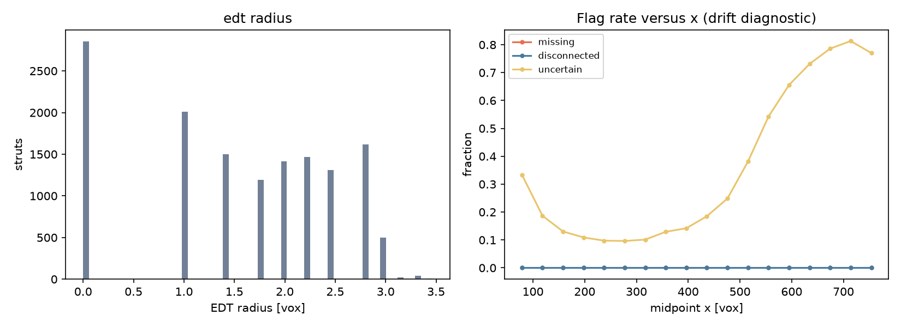
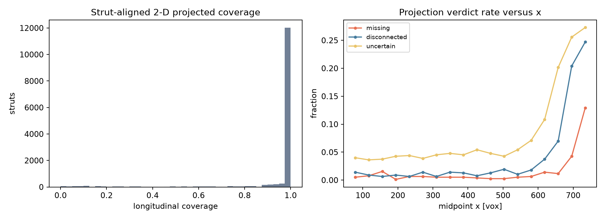
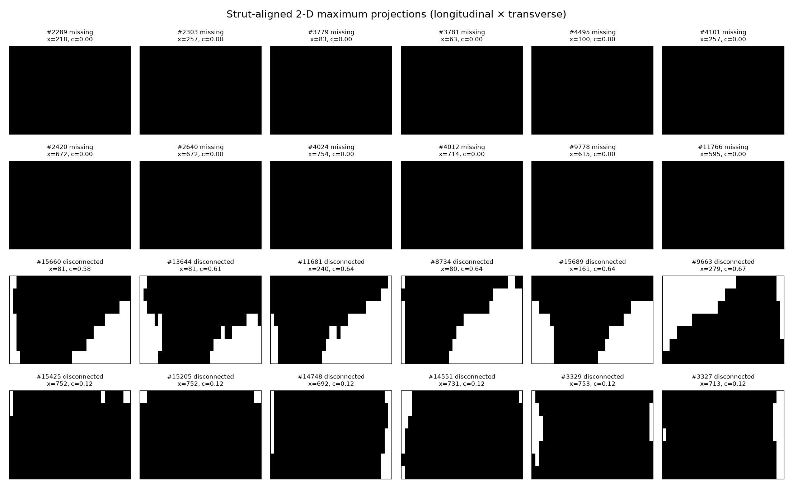
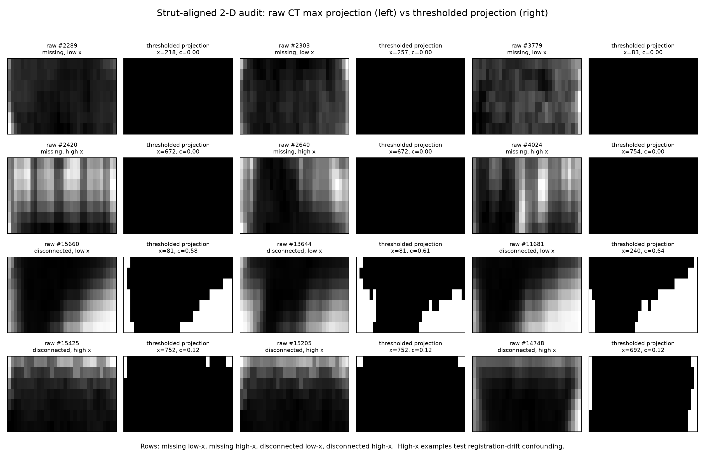
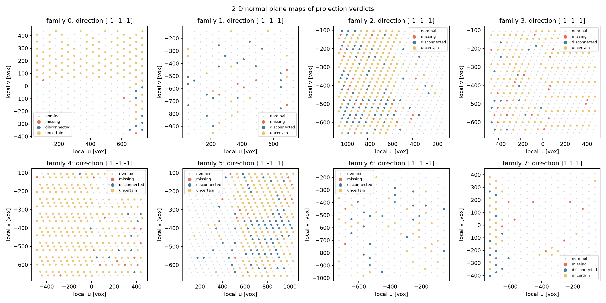

# Registered XCT/design strut-defect method comparison

This run uses the required registered pair: `data/missing_struts/tif_stacks/210127_Brian_Tran_strut_lattices_0point5dash1 1 Slices.tif`, its registered JSON graph, and the supplied Otsu mask (threshold 40127).  It is reproducible with:

```bash
MPLCONFIGDIR=/tmp/mpl_defect python scripts/compare_defect_methods.py
```

There are 18,468 design struts.  The comparison population excludes 4,536 boundary-cap or end-plate struts, leaving **13,932 interior, non-plate struts**.  No cutoff was selected to reproduce a published rate.

## Results

| Method | Inputs / runtime | Verdicts on all eligible struts | Prediction from review | Result |
|---|---|---|---|---|
| Tube-constrained 3-D connectivity | Otsu mask + registered graph; 33 samples over the middle 70% of each strut; radius-3-voxel tube; 9.1 s | nominal 11,347 (81.45%); missing 277 (1.99%); disconnected 1,008 (7.24%); uncertain 1,300 (9.33%) | Flags should not rise monotonically with x; `disconnected` requires material at both ends and a >=4-sample internal empty run. | **Failed as a specimen-level detector.** The topology condition is satisfied by construction, but missing/disconnected/uncertain rates rise strongly with x, so registration drift confounds calls. |
| EDT local-radius supporting score | Otsu mask + graph; reads the previously generated tiled, local-max EDT profile | nominal 9,056 (65.00%); uncertain 4,876 (35.00%); missing 0 | Grossly low radius should agree with low tube coverage. | **Failed as a missing comparator.** Healthy median=2.236 vox; robust sigma=0.747 vox; the preregistered 3-sigma cutoff is -0.006 vox, so no physically possible radius is called missing.  This exposes the EDT quantisation/resolution floor rather than justifying a new cutoff. |
| Strut-aligned 2-D maximum projection | Mask + registered graph; one 33 × 7 longitudinal-by-transverse projection per strut, formed by max-projecting through +/-3 voxels in the second transverse direction; ~10 s | nominal 12,010 (86.20%); missing 214 (1.54%); disconnected 557 (4.00%); uncertain 1,151 (8.26%) | A local 2-D projection should preserve a gap as a dark longitudinal run, but its calls must not acquire an x gradient or disagree strongly with 3-D topology. | **Useful visualization, failed as independent confirmation.** It agrees with the tube verdict for 12,508/13,932 (89.78%) struts, but it still has a high-x excess (3.15% missing and 9.08% disconnected for x > 500), proving shared registration confounding. |

The tube method is deliberately the only one that emits `disconnected`: a radius/coverage score cannot establish end-to-end topology.  Neither method emits thin, dross, or bent on this 58.1-µm CT.  Those labels would overstate what a roughly four-voxel-wide strut can support.

## Agreement and registration diagnostic

The methods give the same verdict for **10,356 / 13,932 (74.33%)** eligible struts.  Their largest disagreement is tube `missing`/`disconnected` versus EDT `uncertain` (the EDT method makes no missing calls).  This is not independent confirmation: both methods are design-referenced and inherit the same local alignment error.

| Region | n | Tube missing | Tube disconnected | Tube uncertain | EDT uncertain |
|---|---:|---:|---:|---:|---:|
| All eligible | 13,932 | 1.99% | 7.24% | 9.33% | 35.00% |
| Operational low-drift subset, midpoint x <= 300 vox | 4,896 | 0.72% | 1.10% | 3.31% | 15.67% |
| High-drift check, midpoint x > 500 vox | 5,166 | 4.39% | 17.21% | 18.84% | 66.84% |

The highest-x bin (638--754 vox) reaches 8.92% missing and 28.39% disconnected, compared with 0.47--0.99% missing and 0.69--1.59% disconnected in the first four x bins.  This is the documented 0--3-voxel registration drift, not credible evidence of a defect gradient.  Consequently, the low-drift subset is the less-confounded diagnostic subset, but it is **not** promoted to a validated defect rate.

For context, Tran *et al.* report 0.57% missing and 4.97% disconnected for this specimen (as supplied in the project protocol).  The all-region tube values are higher, while the low-drift subset is 0.72%/1.10%.  Neither pair supports threshold tuning or a claim of reproduction; the x-dependence is the deciding evidence.

## Direct 2-D versus 3-D comparison

The 2-D method is a maximum projection through a local transverse slab; the 3-D method tests occupancy in a full local tube.  They use the same registered graph, mask, interior/non-plate population, and 33 longitudinal samples, so the comparison isolates the effect of dimensionality/projection.



| Comparison, 13,932 eligible struts | Count | Interpretation |
|---|---:|---|
| Exact same verdict | 12,508 (89.78%) | High agreement, but not independent validation: both inherit the same registration field. |
| Both missing | 157 | The strongest common candidate subset, still requiring local registration review. |
| Both disconnected | 397 | Common gap candidates, but also concentrated toward high x. |
| 2-D nominal, 3-D disconnected | 326 | Expected projection failure mode: material anywhere along the max-projection direction can fill a gap that the 3-D tube resolves. |
| 2-D disconnected, 3-D nominal | 59 | The projected slab can admit neighbouring material/offset geometry and create a false longitudinal interruption. |
| At least one method uncertain | 1,729 | Abstention is appropriate where the measured data cannot distinguish a defect from registration error. |

The 2-D maximum projection makes fewer calls than 3-D (1.54% vs 1.99% missing; 4.00% vs 7.24% disconnected).  That is expected because a maximum projection is presence-biased: one foreground voxel through the slab makes a local 2-D position appear intact.  The right panel shows that both methods still increase at high x, so 2-D reformatting corrects oblique-slice geometry but not local alignment drift.  Use 2-D for rapid candidate visualization and 3-D topology for connectivity adjudication after local registration refinement.

Machine-readable comparison files: [confusion matrix](2d_vs_3d/confusion_matrix.csv), [summary](2d_vs_3d/summary.json), and [generator](../../scripts/compare_2d_3d.py).

## Outputs and visual checks

- Tube method: [per-strut CSV](tube_connectivity/struts.csv), [raw measurements](tube_connectivity/raw_measurements.npz), [diagnostic plot](tube_connectivity/diagnostics.png), [interactive overlay](tube_connectivity/viewer.html).
- EDT method: [per-strut CSV](edt_radius/struts.csv), [raw measurements](edt_radius/raw_measurements.npz), [diagnostic plot](edt_radius/diagnostics.png), [interactive overlay](edt_radius/viewer.html).
- [Comparison arrays](comparison_arrays.npz) retain the common eligible mask and raw metrics; [run metadata](run_metadata.json) records fixed sampling and robust-reference parameters.

### Tube-connectivity diagnostic



The right panel is the decisive quality-control graph.  It shows the high-x increase in missing, disconnected, and uncertain calls; a true defect population should not follow the known registration-drift direction this closely.

### EDT-radius diagnostic



The EDT histogram shows the coarse, quantized radius support.  The accompanying x plot shows that abstentions, rather than a stable low-radius defect population, grow in the high-drift region.

### Registered 3-D visual overlays

| Tube-connectivity verdicts | EDT-radius verdicts |
|---|---|
| [Open interactive overlay](tube_connectivity/viewer.html) | [Open interactive overlay](edt_radius/viewer.html) |
| Missing = orange; disconnected = blue; uncertain = yellow. | Nominal = gray; unresolved measurements = yellow. |

The HTML overlays show the coarse as-built mask and the same registered struts used for every CSV row.  They are intended for adjudicating whether an apparent gap is material absence or local graph/mask offset; they do not validate a classification merely by rendering it.

## Strut-aligned 2-D projection experiment

This experiment follows the strut-local reformat idea behind Contour View rather than analysing axis-aligned CT slices.  Each registered strut is transformed to `(longitudinal, transverse-1, transverse-2)` coordinates.  The mask is maximum-projected along transverse-2, yielding a compact **33 × 7** image.  Thus a healthy oblique strut becomes a longitudinal band instead of a sequence of tilt-dependent ellipses.









- [Per-strut projection verdicts](strut_aligned_2d_projection/struts.csv) and [raw 2-D profiles](strut_aligned_2d_projection/raw_measurements.npz).
- [Method metadata](strut_aligned_2d_projection/metadata.json) records the transform and fixed projection geometry.
- [Implementation](../../scripts/project_struts_2d.py).

The raw-CT audit pairs each local intensity projection with its thresholded counterpart, in low-x and high-x groups.  It is intentionally diagnostic rather than promotional: completely black candidate images are missing candidates, while several apparently disconnected bands can be produced by nearby geometry entering the slab or by local graph/mask displacement.  The projection is a useful triage view and agrees substantially with the tube screen, but a maximum projection can hide an out-of-plane gap.  It must not be used to replace the 3-D connectivity test.

## What failed, and what remains useful

1. **Tube connectivity failed its no-x-gradient prediction.** It remains the right *measurement definition* for a genuine disconnection, but this global registration cannot support a part-wide rate.  Next work should locally refine graph-to-mask alignment, then rerun the unchanged topology rule and inspect the x-rate plot before releasing counts.
2. **EDT failed its gross-absence agreement prediction.** Its robust healthy reference makes its 3-sigma lower cutoff negative.  Recutting it to manufacture flags would be threshold tuning.  Keep EDT radius as a raw, per-strut visualization column only.
3. **Thin/dross/bent are intentionally absent from real-CT verdicts.** They require the supplied 17.8-µm labelled unit-cell set and a strut-aligned local-volume implementation; the unit-cell OBJ/volume files are not registered to this 18,468-strut real-part JSON, so they were not substituted into this comparison or used to claim a real-part rate.
4. **2-D projection is not an escape from registration.** The transformed-space projection removes oblique-slice geometry, but its high-x calls show that it retains the registered-centreline error.  Use it to inspect candidates after local registration refinement, not to publish a rate.

Published-method screening and the resolution rationale are in [the methods review](../literature/METHODS_REVIEW.md).
