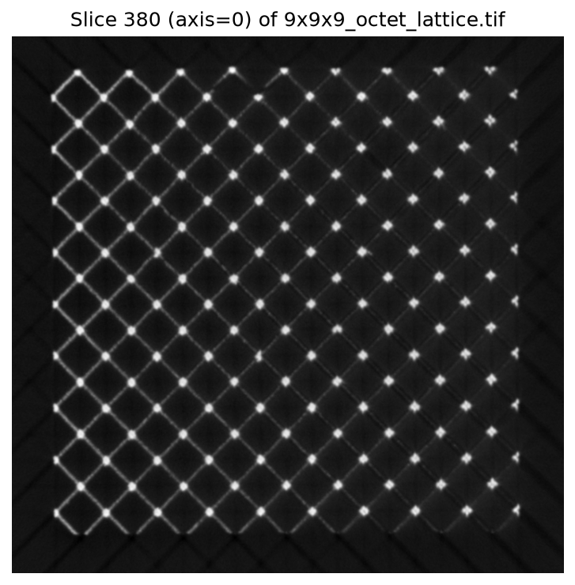
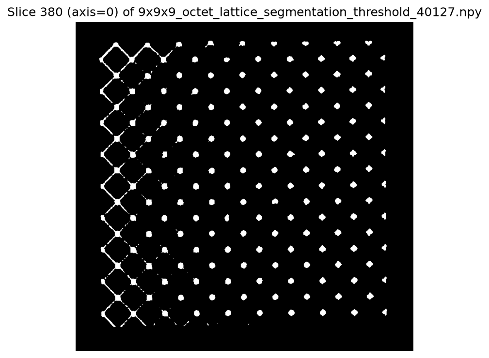
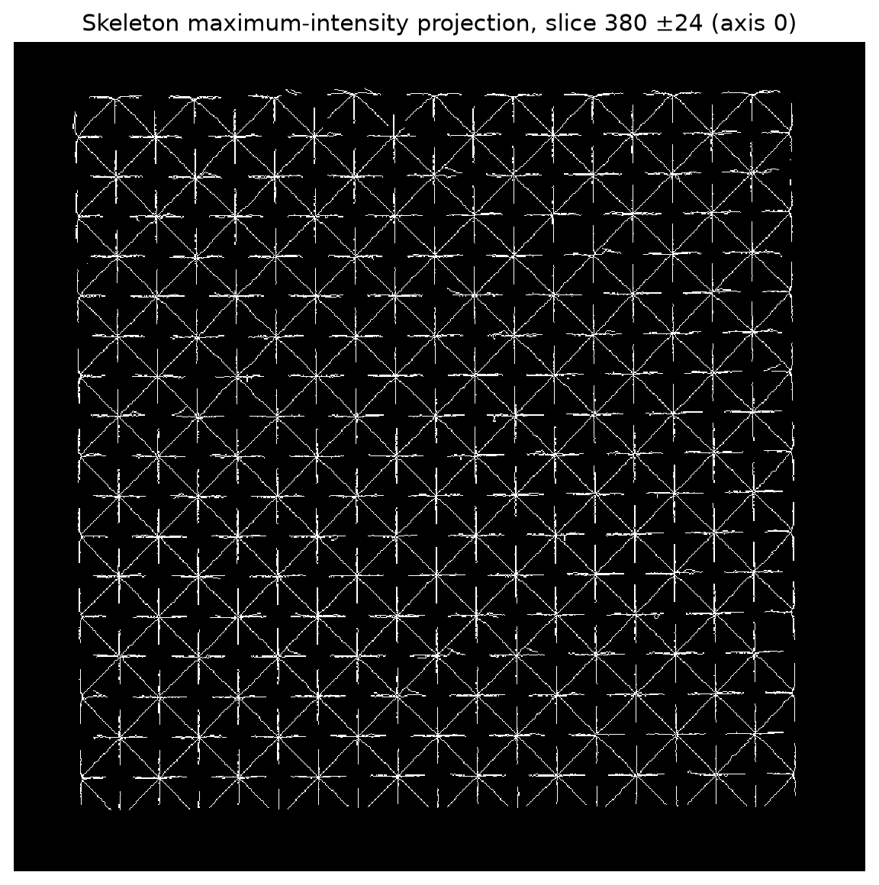
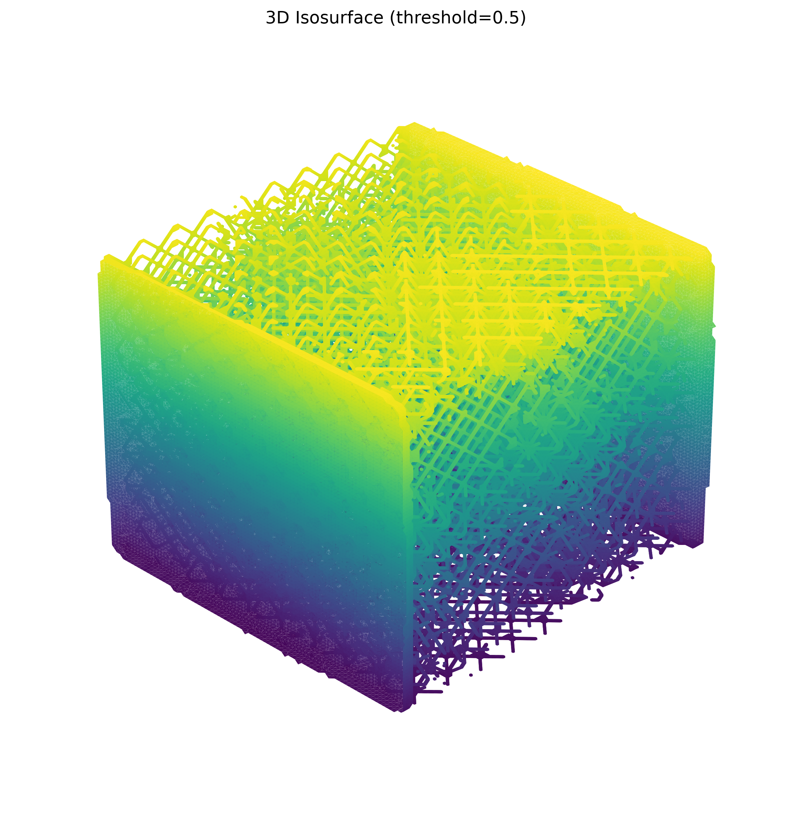
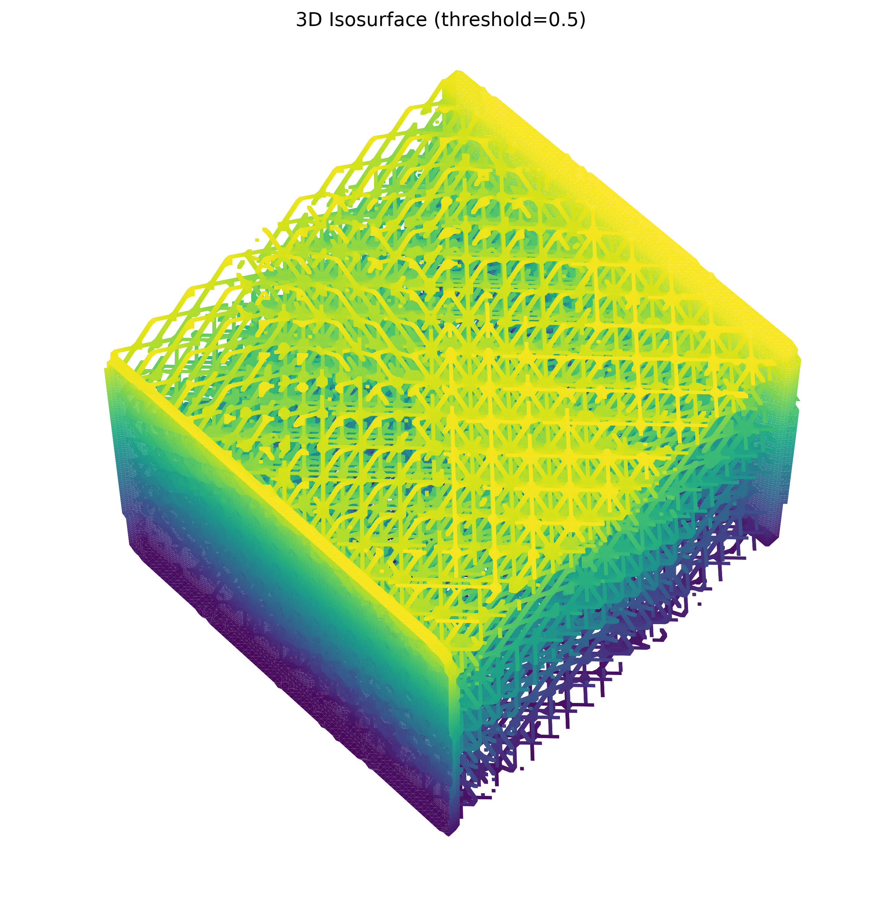

# NDE report — 9×9×9 octet lattice

The 16-bit CT TIFF was segmented with an Otsu threshold of **40,127**. The resulting mask and its 3-D skeleton have identical dimensions to the raw volume: 761 × 815 × 837 voxels.

| Item | Result |
| --- | ---: |
| CT intensity range | 0–65,535 |
| Segmentation threshold | 40,127 |
| Material voxels | 58,333,372 (11.237%) |
| Background voxels | 460,786,583 (88.763%) |
| Mean material intensity | 47,534.18 |
| Skeleton voxels | 1,064,063 (0.205%) |
| Skeleton endpoints* | 2,234 |
| Skeleton branch voxels* | 320,941 |
| Isolated skeleton voxels* | 389 |

\*Connectivity counts use the 26-voxel neighborhood; branch-voxel counts describe local skeleton complexity rather than a collapsed graph-node count.

## Slice-380 inspection

| Raw CT | Binary segmentation | Skeleton MIP (slice 380 ±24) |
| --- | --- | --- |
|  |  |  |

The segmentation preserves the repeating octet-lattice pattern visible in the raw CT slice while rejecting the low-density background. A single skeleton plane is necessarily sparse, so the skeleton panel is a labelled 49-slice maximum-intensity projection centered at slice 380; it makes the connected centerlines visible for strut and node analysis.

## 3-D views of the segmented lattice

| View A: elevation 30°, azimuth 45° | View B: elevation 60°, azimuth 45° |
| --- | --- |
|  |  |

The 3-D renderings use an 8× spatial downsample solely for visualization; the segmentation and skeleton arrays retain full resolution.
