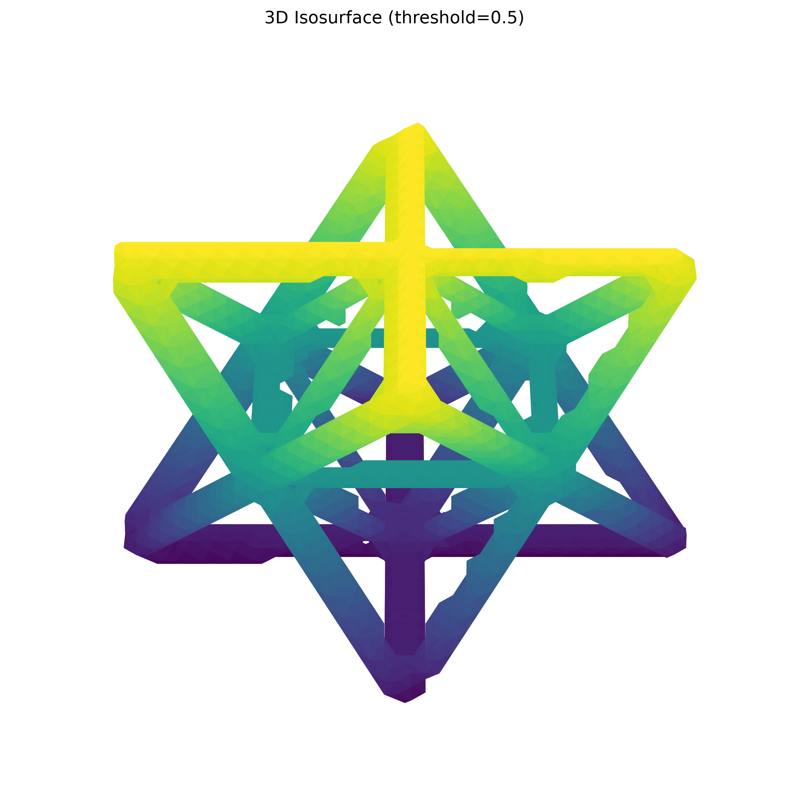
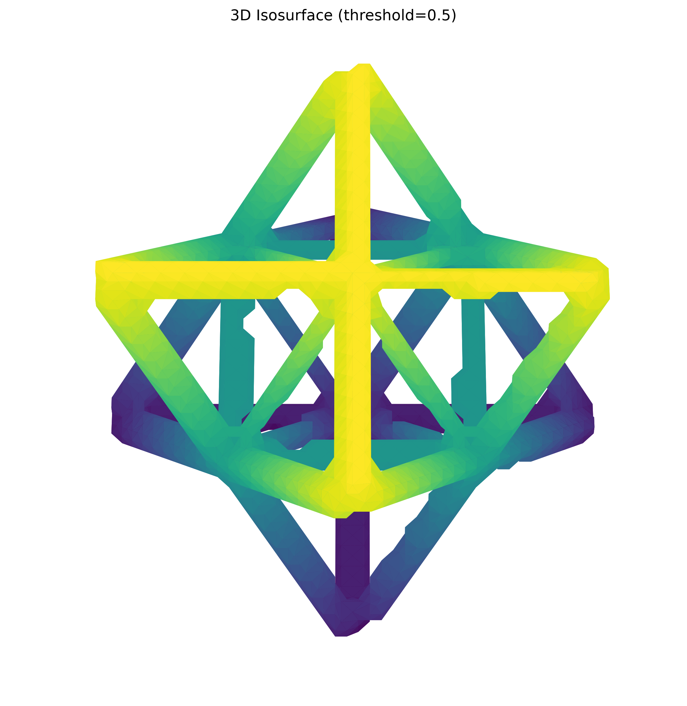

# Non-destructive evaluation report

## Scope and provenance

This report analyzes the two distinct CT volumes under `data/` that have compatible segmentation masks and skeletons. The TIFF at `data/missing_struts/tif_stacks/` is byte-identical to the 9×9×9 octet-lattice TIFF, so it is intentionally not counted as a separate specimen. Meshes, JSON metadata, and 2-D reference PNGs are supporting files rather than volumetric CT inputs.

All raw, mask, and skeleton arrays were checked for identical shape before measurement. Foreground is the mask value greater than zero. Skeleton complexity is measured in a 26-voxel neighborhood; branch-voxel counts are local complexity indicators, not collapsed graph-node counts.

## Summary

| Dataset | Raw volume | Mask source | Shape | Material voxels | Material fraction | Mean material intensity | Skeleton voxels | Endpoints | Branch voxels | Isolated skeleton voxels |
| --- | --- | --- | ---: | ---: | ---: | ---: | ---: | ---: | ---: | ---: |
| 9×9×9 octet lattice | 16-bit TIFF, range 0–65,535 | Threshold-40,127 (Otsu) mask | 761×815×837 | 58,333,372 | 11.237% | 47,534.18 | 1,064,063 | 2,234 | 320,941 | 389 |
| Unit cell | float32 NPY, range −0.00313–0.01526 | Provided Otsu mask | 256×256×256 | 717,852 | 4.279% | 0.011696 | 3,182 | 39 | 137 | 0 |

## 9×9×9 octet lattice

The threshold mask isolates the high-density, periodic lattice from the background. Its full-resolution skeleton retains more than one million centerline voxels, revealing a highly connected strut network. The small isolated-voxel count merits attention only if a later defect workflow requires cleanup of short fragments.

| View A — elevation 30°, azimuth 45° | View B — elevation 60°, azimuth 45° |
| --- | --- |
|  |  |

## Unit cell

The provided Otsu mask selects a compact material region (4.279% of the volume). Its skeleton has no isolated voxels under the 26-neighborhood test, consistent with a connected unit-cell structure. The endpoint and branch counts are expected to depend on the cropped volume boundaries and should not alone be treated as defect counts.

| View A — elevation 30°, azimuth 45° | View B — elevation 60°, azimuth 45° |
| --- | --- |
|  |  |

## Rendering note

The visualizations use 8× spatial downsampling only for responsive marching-cubes rendering. All tabulated measurements were computed from the full-resolution arrays.
