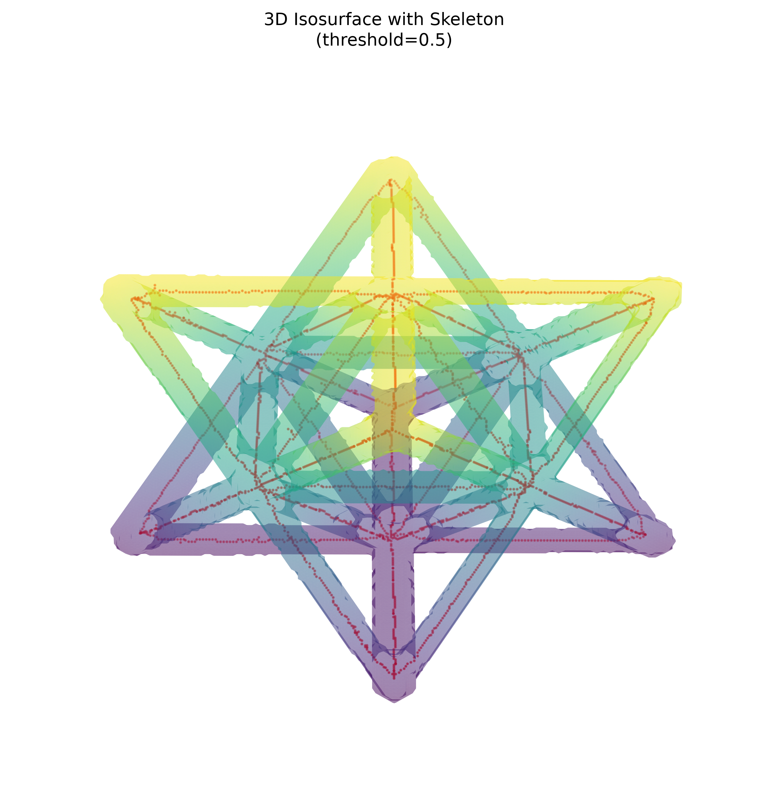
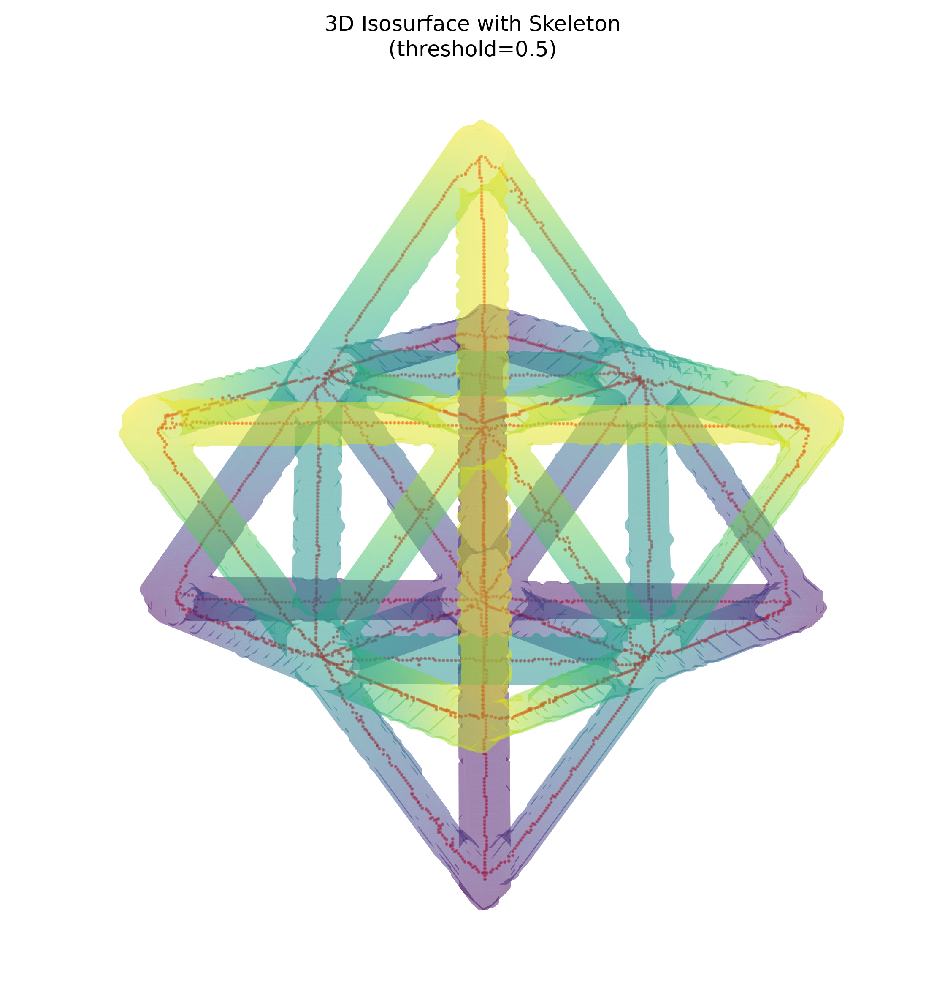

# Non-Destructive Evaluation Report: Unit-Cell Structure

**Report date:** 2026-07-22  
**Evaluation basis:** Arrays available in `data/`

## Executive summary

The supplied segmentation contains 721,774 foreground voxels, occupying 4.3021% of the 256 x 256 x 256 field of view. Its skeleton contains 3,173 centerline voxels, 47 endpoints, and 168 branch voxels under a 26-neighbor definition. The arrays have identical shapes, each is a single 26-connected component, and all skeleton voxels lie inside the segmented region.

No raw intensity volume or voxel spacing was supplied. Consequently, raw-volume mean intensity, physical volume and length, and direct segmentation-to-CT intensity alignment cannot be determined from these files.

## Inputs and compatibility

| Role | Artifact | Shape | Type | Status |
| --- | --- | ---: | --- | --- |
| Original intensity volume | Not supplied | — | — | Unavailable |
| Segmentation mask | `data/unitcell_segmentation_threshold_0.005.npy` | 256 x 256 x 256 | `uint8`, binary | Available |
| Skeleton | `data/skeleton.npy` | 256 x 256 x 256 | `bool`, binary | Available |

The mask and skeleton are shape-compatible. Both contain only binary values, so neither file can provide raw CT intensity statistics.

## Summary metrics

| Dataset | Intensity / occupancy | Volume or length proxy | Complexity / alignment |
| --- | ---: | ---: | ---: |
| Original intensity volume | Mean intensity unavailable | Physical volume unavailable | CT-to-mask alignment unavailable |
| Segmentation mask | Foreground fraction: 4.3021% | 721,774 foreground voxels | 1 component (26-connectivity) |
| Skeleton | Occupancy: 0.01891% | 3,173 centerline voxels | 47 endpoints; 168 branch voxels; mean degree 2.058; maximum degree 8; 1 component |

Centerline voxel count is a length proxy, not a physical length. Branch voxels are skeleton voxels having at least three occupied neighbors in a 3 x 3 x 3 neighborhood; adjacent branch voxels have not been consolidated into unique junctions.

## Visual gallery

| View A — elevation 30°, azimuth 45° | View B — elevation 60°, azimuth 45° |
| --- | --- |
|  |  |

The translucent surface represents the segmentation at isovalue 0.5 after 2x display downsampling. Red points represent the full-resolution skeleton coordinates scaled to the displayed surface. Downsampling affects only the renderings, not the metrics.

## Alignment analysis

Mask-to-skeleton alignment is internally consistent:

- Shapes match exactly at 256 x 256 x 256.
- All 3,173 skeleton voxels are contained within the mask; none fall outside it.
- Skeleton size is 0.4396% of mask foreground size, consistent with centerline reduction of a volumetric lattice.
- Both artifacts form one 26-connected component, so no disconnected derived fragments were detected.

Direct mask-to-original-volume alignment is **not verified** because the raw intensity array is absent. Foreground/background intensity separation, boundary agreement, false-positive regions, and missed low-density material therefore cannot be quantified.

## NDE interpretation and limitations

- The derived artifacts preserve a connected strut-like topology suitable for centerline analysis.
- Endpoint and branch-voxel counts are morphological descriptors, not defect classifications. Boundary terminations and skeletonization behavior can contribute endpoints and clustered branch voxels.
- No defensible conclusion about missing, broken, thin, bent, or excess-material features can be made without the raw CT volume, voxel spacing, reference geometry, and acceptance criteria.
- For closeout, supply the original CT volume and voxel spacing, validate the recorded segmentation threshold of 0.005 against the intensity distribution, and compare consolidated skeleton junctions and edges with the expected design graph.

## Reproducibility notes

Metrics were computed directly from the supplied arrays without resampling. Neighbor degree, endpoints, branch voxels, and connected components use 26-connectivity. The two renderings were generated with the repository-provided `3d_visualize.py`, using threshold 0.5, display downsampling factor 2, azimuth 45°, and elevations 30° and 60°.
