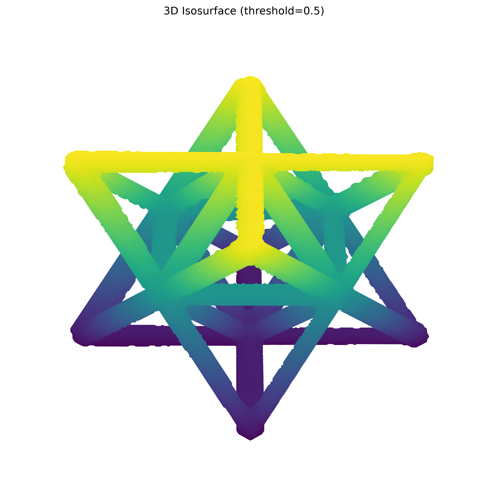
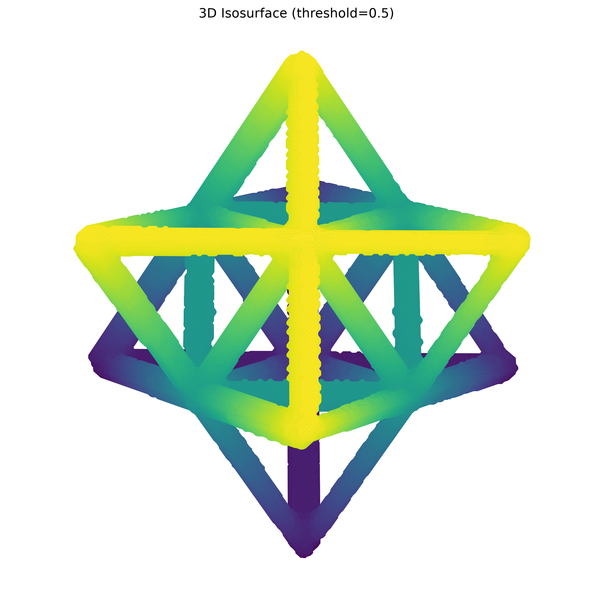

# NDE Report — Octet-Truss Unit Cell

**Dataset:** `data/unitcell/unitcell.npy`  
**Acquisition note:** `octet_truss_unit_cell_no_defects_0256_xray_recon`  
**Segmentation / centerline inputs:** `unitcell_mask_otsu.npy`, `unitcell_skeleton_otsu.npy`

## Summary

The 256 × 256 × 256 X-ray reconstruction contains a single connected octet-truss unit-cell structure. The supplied Otsu segmentation occupies 4.279% of the reconstruction volume and is exactly reproduced by applying Otsu thresholding to the intensity volume. The skeleton is also a single connected network.

| Category | Metric | Value |
|---|---|---:|
| Volume | Dimensions | 256 × 256 × 256 voxels |
| Volume | Total voxels | 16,777,216 |
| Volume | Mean intensity | 0.000539 |
| Volume | Intensity range | −0.003129 to 0.015258 |
| Mask | Foreground volume | 717,852 voxels (4.279%) |
| Mask | Connected components (26-connectivity) | 1 |
| Mask | Mean foreground intensity | 0.011696 |
| Mask | Mean background intensity | 0.000040 |
| Skeleton | Skeleton voxels | 3,182 |
| Skeleton | Connected components (26-connectivity) | 1 |
| Skeleton | Centerline length | 4,605.09 voxel units |
| Skeleton | Neighbor links | 3,244 |
| Skeleton | End-point voxels | 39 |
| Skeleton | Junction voxels (≥3 26-neighbors) | 137 |
| Skeleton | Mean / maximum degree | 2.039 / 6 |

*Centerline length uses Euclidean 26-neighbor step lengths. Physical units cannot be reported because voxel spacing was not supplied.*

## 3D Visual Gallery

### View A — elevation 30°, azimuth 45°

### View B — elevation 60°, azimuth 45°

## Mask-to-Volume Alignment

The Otsu cutoff calculated directly from the reconstruction is **0.005813**. It reproduces the provided mask exactly: Dice = **1.000** and IoU = **1.000**. Foreground intensity (0.011696 mean) is roughly 290 times the background mean (0.000040), indicating strong contrast and clean separation of the solid struts from the surrounding volume. The single-component mask and skeleton, together with the views above, show a continuous, well-aligned octet-truss network; no disconnected segmented regions are present.

## Method

Array-shape compatibility was verified before analysis (all inputs: 256 × 256 × 256). The mask was rendered as an isosurface after 2× spatial downsampling, using a normalized threshold of 0.5. Junction and endpoint counts use 26-connected skeleton-neighbor degrees.
