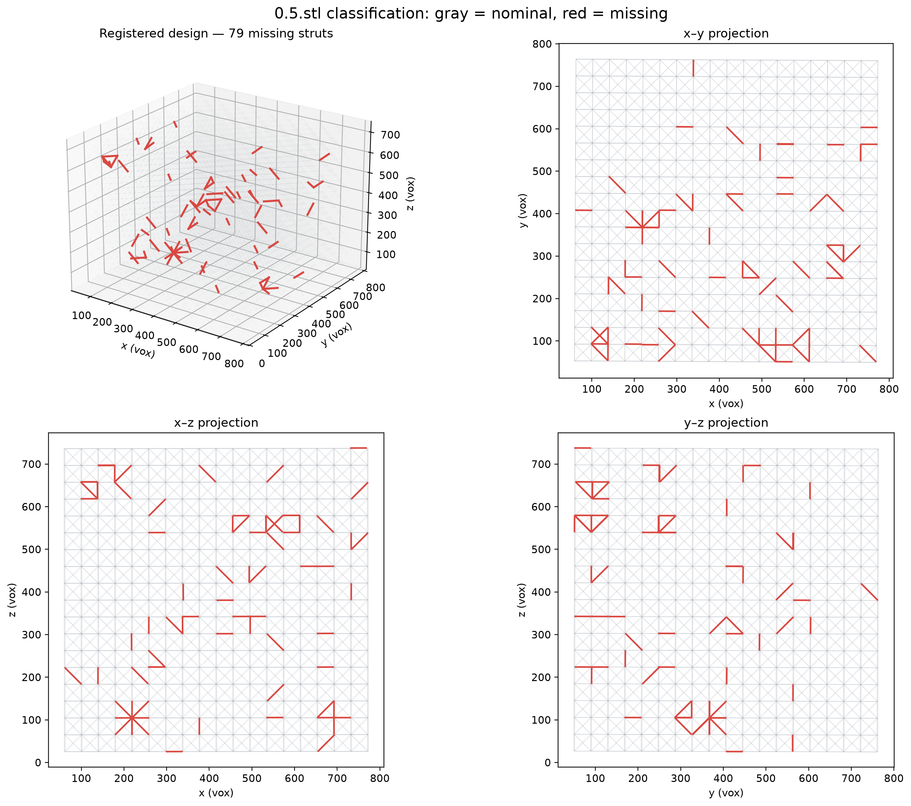

# Missing-strut report — `0.5.stl`

## Result

Comparison of the complete CAD mesh (`0.stl`) with the 0.5%-nominal missing-strut
mesh (`0.5.stl`), using the registered design graph
`210127_Brian_Tran_strut_lattices_0point5dash1 1 Slices.json`, identified **79 struts**
whose interior has a positive, robust increase in distance to the STL surface.  They are
listed as `missing` in [`0.5_missing_struts.csv`](0.5_missing_struts.csv); the file also
contains the remaining 18,389 JSON struts as `nominal` rows.

The detected JSON strut IDs are:

```text
2872, 2845, 2948, 16358, 2944, 2921, 935, 12668, 955, 3492, 859, 16695, 2868, 16769, 15056, 2952,
4925, 12722, 2860, 1504, 4500, 12662, 11142, 7509, 12676, 6997, 7022, 14675, 7041, 13631, 9601, 6673,
10216, 4657, 14142, 2929, 14129, 16687, 15859, 915, 11285, 938, 7670, 16130, 17588, 12246, 16129, 11145,
6321, 8187, 12250, 13573, 12270, 14143, 14130, 14258, 762, 4093, 10223, 12697, 17455, 4318, 8357, 714,
7305, 12271, 9497, 14257, 16688, 13628, 12247, 2383, 12601, 14154, 9934, 12252, 4100, 4097, 8185
```

## Classification visualizations



- Static figure: [`0.5_strut_classification.png`](0.5_strut_classification.png).  It shows
  an isometric view plus the three orthogonal projections; gray is nominal and red is
  missing.
- Interactive viewer: [`0.5_strut_classification.html`](0.5_strut_classification.html).
  It supports rotate, pan, zoom, and class toggles.

The CAD-to-CAD comparison found no partial or `broken/gap` classification.  A broken-gap
call requires an as-built CT mask and a topological continuity test; this mesh comparison
can only establish that a nominal member is absent from the defective CAD.

## Inputs

| Role | File |
| --- | --- |
| Complete reference CAD | `data/missing_struts/stls/0.stl` |
| Inspected CAD | `data/missing_struts/stls/0.5.stl` |
| Registered strut graph | `data/missing_struts/registered_jsons/210127_Brian_Tran_strut_lattices_0point5dash1 1 Slices.json` |
| Common graph coordinate reference | `data/missing_struts/octet_truss_9x9x9.json` |

Both JSON graphs have 10,206 junctions and 18,468 struts with matching IDs.  The
registered graph is in CT voxels; the STL is in millimetres.

## Method

1. Fit the shared junction IDs from the registered JSON back to the nominal 0–18 CAD
   grid.  The fit is exact to printed precision.
2. Map that CAD grid into the STL bounding box.
3. Sample each strut at nine positions over its central 20–80%, avoiding junction blobs.
4. For each sample, calculate nearest-surface distance in `0.stl` and `0.5.stl`.
5. Score a strut by the 25th percentile of `(distance to 0.5 surface − distance to 0 surface)`.
   This requires absence over most of the interior, rather than a single anomalous endpoint.
6. Label a strut `missing` when its score is greater than `1e-6 mm`.  There are 79 such
   struts; the next score is exactly zero, so no percentage-derived threshold was forced.

## Detection strength

| Statistic of 79 missing scores (mm) | Value |
| --- | ---: |
| Minimum | 0.000002 |
| 25th percentile | 0.006866 |
| Median | 0.068285 |
| 75th percentile | 0.319100 |
| Maximum | 0.845021 |

The registered-coordinate midpoints of the detected members span approximately
`x=80.7–752.7`, `y=51.1–742.9`, `z=25.6–737.8` voxels, so calls are not concentrated in
one local region.

## Limitations

- The `0.5` filename is a nominal design label, not a verified ground-truth count.  The
  geometry-supported result is 79 positive-score calls; forcing 0.5% of 18,468 (92) would
  add 13 zero-score rows and is not justified.
- An unmarked octet lattice has reflection and axis-permutation symmetry.  The reported
  strut IDs use the nominal CAD-to-STL orientation convention.  An external fiducial or
  explicit STL transform is required to rule out symmetry-equivalent relabellings.
- This is a CAD-versus-CAD absence check.  It should not be used as a defect call on the
  measured CT without using the registered CT mask and accounting for build variation.

## Reproducibility

```bash
python scripts/find_missing_stl_struts.py \
  'data/missing_struts/registered_jsons/210127_Brian_Tran_strut_lattices_0point5dash1 1 Slices.json' \
  data/missing_struts/octet_truss_9x9x9.json \
  data/missing_struts/stls/0.stl \
  data/missing_struts/stls/0.5.stl \
  -o outputs/stl_missing_struts/0.5_missing_struts.csv
```
