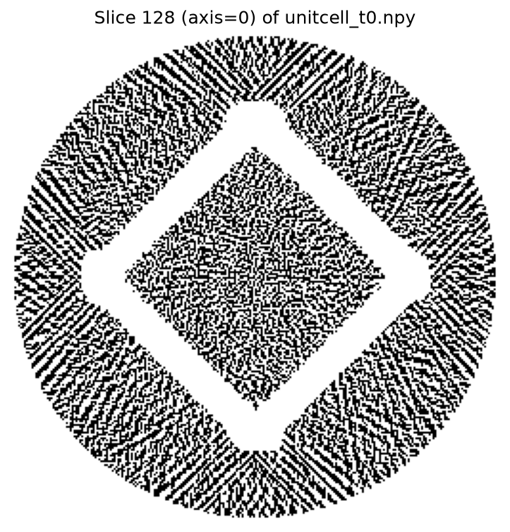
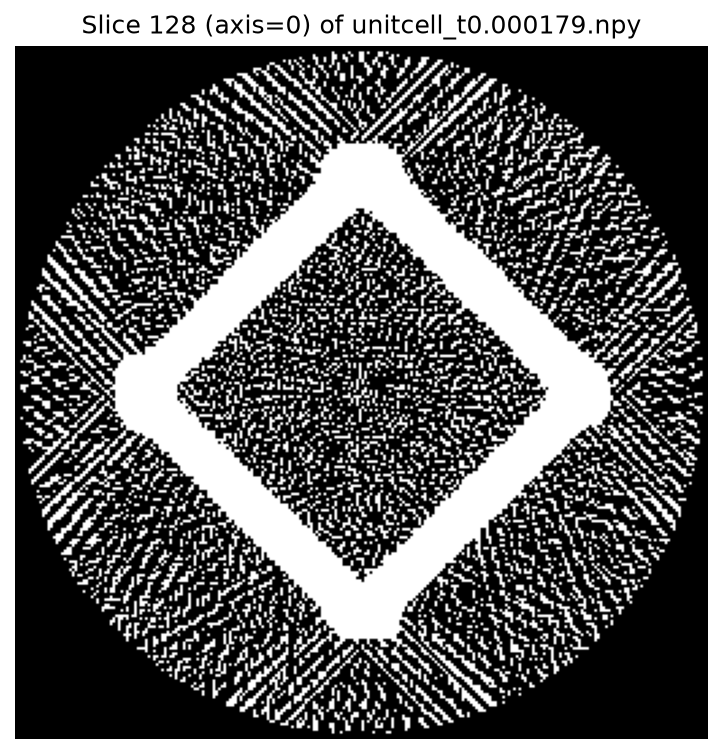
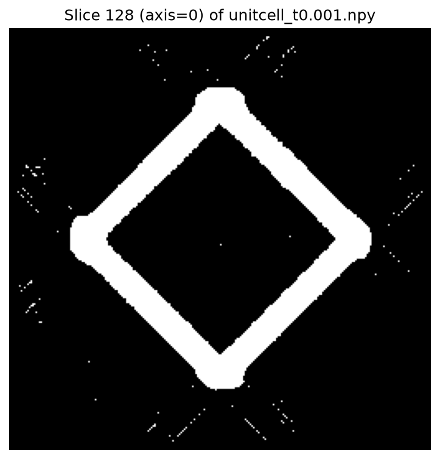
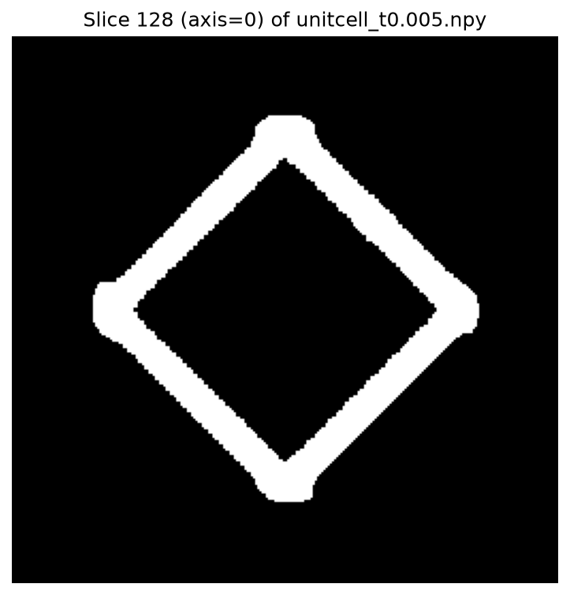
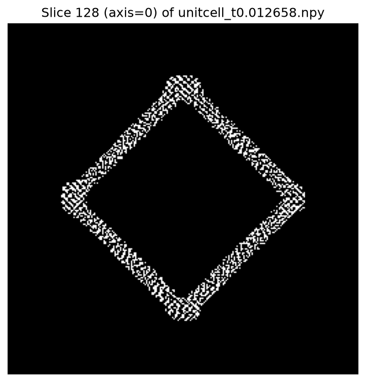

# Unitcell segmentation threshold sweep

## Input profile

| Property | Value |
| --- | ---: |
| Shape | `(256, 256, 256)` |
| Dtype | `float32` |
| Minimum | -0.0031287500 |
| Maximum | 0.0152576920 |
| Mean | 0.0005390669 |
| 1st percentile | -0.0010796102 |
| 25th percentile | -0.0000413531 |
| 50th percentile | 0.0000000000 |
| 75th percentile | 0.0001794715 |
| 99th percentile | 0.0126584026 |

The five thresholds span the background-dominated median through the high-density material tail: `0`, `0.000179`, `0.001`, `0.005`, and `0.012658`.

## Sweep results

| Threshold | Foreground voxels | Foreground fraction | Tool status |
| ---: | ---: | ---: | --- |
| 0 | 11,371,529 | 67.7796% | Saved binary segmentation to outputs/threshold_sweep/unitcell/unitcell_t0.npy (threshold=0.0, shape=(256, 256, 256), foreground_voxels=11371529) |
| 0.000179 | 4,194,304 | 25.0000% | Saved binary segmentation to outputs/threshold_sweep/unitcell/unitcell_t0.000179.npy (threshold=0.00017947150627151132, shape=(256, 256, 256), foreground_voxels=4194304) |
| 0.001 | 1,043,622 | 6.2205% | Saved binary segmentation to outputs/threshold_sweep/unitcell/unitcell_t0.001.npy (threshold=0.001, shape=(256, 256, 256), foreground_voxels=1043622) |
| 0.005 | 721,774 | 4.3021% | Saved binary segmentation to outputs/threshold_sweep/unitcell/unitcell_t0.005.npy (threshold=0.005, shape=(256, 256, 256), foreground_voxels=721774) |
| 0.012658 | 167,773 | 1.0000% | Saved binary segmentation to outputs/threshold_sweep/unitcell/unitcell_t0.012658.npy (threshold=0.012658402556553481, shape=(256, 256, 256), foreground_voxels=167773) |

All preview images are axis-0, slice 128:

### Threshold = 0 — foreground 67.7796%

### Threshold = 0.000179 — foreground 25.0000%

### Threshold = 0.001 — foreground 6.2205%

### Threshold = 0.005 — foreground 4.3021%

### Threshold = 0.012658 — foreground 1.0000%

## Recommendation: threshold = 0.005

`0.005` is the best cutoff. Compared with `0.001`, it removes isolated exterior speckles while retaining a continuous, well-filled strut cross-section. The higher `0.012658` cutoff reduces the foreground to 1% and visibly fragments the struts. The 4.3021% material fraction is also a stable, plausible level after the sharp background-to-material transition at lower thresholds.

## Ground-truth check

`data/unitcell/ground_truth_segmentation_image.png` is a 3D rendered reference, not a named 2D slice, so it does not identify a slice index to reproduce. The comparable mid-slice used throughout this sweep is axis 0, index 128.

### Ground truth

### Recommended threshold (axis 0, slice 128)

